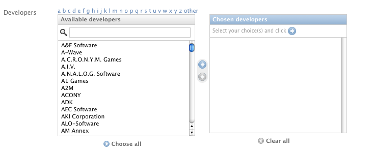
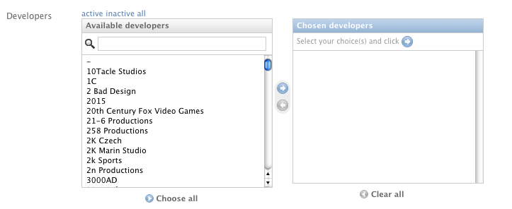

====================
Django Selectfilter
====================

:Author: Francesco Banconi <francesco.banconi@gmail.com>
:Author: Marcel Dancak <marcel.dancak@gista.sk>
:Author: Ivan Mincik <ivan.mincik@gista.sk>

.. contents:: Index

.. sectnum::

Introduction
============

Theese fields may be used in a **many to many** relation, 
where the user may want to apply filters to the listed objects, 
because of they being too many, or just for usability reasons.

Technical details
~~~~~~~~~~~~~~~~~

When the user clicks on the chosen filter, an *Ajax* request is sent. It
returns the matching elements in *JSON* format. The *jQuery* Javascript
library is used.

Installation
============

The ``selectfilter`` package, included in the distribution, should be
placed on the *Python path*.

Usage
=====

As a usage example, let's put the *MyModel* model in a many to many relation
with the *RelatedModel* one, via the ``related_models`` field.

1. copy to your media directory the Javascript file **selectfilter.js**
   included in ``media/js/`` within the distribution;

2. add this line to your Django project's ``urls.py``::

    (r'^selectfilter/', include('selectfilter.urls')),

3. in the model **form**, choose the field you want to use, reference
   the formerly copied Javascript file, the jQuery library and the 
   *django admin*'s Javascript code that mutates the *select* widget into 
   a *selectfilter* one::

    from selectfilter.forms import AjaxManyToManyField
    from django.conf import settings 
    
        class MyModelForm(forms.ModelForm):
            # lookups explained below
            related_objects = AjaxManyToManyField(RelatedModel, lookups)
            
            class Meta:
                model = Model
            
            class Media:
                js = (
                    settings.ADMIN_MEDIA_PREFIX + "js/SelectBox.js",
                    settings.ADMIN_MEDIA_PREFIX + "js/SelectFilter2.js",
                    '/path/to/javascripts/jquery.js',
                    '/path/to/javascripts/selectfilter.js',
                )
                
4. if the form is being used outside of the auto generated django admin, you
   have to load several *django admin*'s Javascript files from the page where
   the field will be shown::
    
    
    
    
    
5. if your form is used by **non-staff users** (e.g. in the frontend of your site)
   then ```` will
   not work (due to permission problems).
   
   A simple work around to resolve the problem is to directly point a 
   url to the view by including the following line in the urls.py::

    (r'^dynamic-media/jsi18n/$', 'django.views.i18n.javascript_catalog'), 
    or 
    (r'^dynamic-media/jsi18n/$', 'django.views.i18n.null_javascript_catalog'), 

   depending on whether or not you use the i18n 

   and then referencing the new url in place of 
   ``admin/jsi18n/`` in the page where you need an ajax filtered field.
    
6. if you want **i18n** for *ManyToManyByLetter*, *ManyToManyByStatus* and
   *ManyToManyByRelatedField* fields (see below for details about available fields),
   add ``'selectfilter'`` to the ``INSTALLED_APPS`` in your *settings.py*.
   The only languages currently available are English and Italian.
   

Available fields
================

AjaxManyToManyField
~~~~~~~~~~~~~~~~~~~

Base many to many form field class that displays filter choices using 
jQuery Ajax requests.

**Usage**::

    from selectfilter.forms import AjaxManyToManyField
    # in the form
    related_objects = AjaxManyToManyField(
        model, lookups, default_index=0, select_related=None, filter_widget=SelectBoxFilter, *args, **kwargs)

**Arguments**:

- *model*: the related model

- *lookups*: a sequence of ``(label, lookup_dict)`` specifying object
  filtering, e.g.:: 

    (
        ('active', {'is_active': True}),
        ('inactive', {'is_active': False}),
    )

  you may specify what you want in ``lookup_dict``, give multiple filter
  lookups for the same choice and also set a choice that gets all unfiltered
  objects, e.g.:: 

    (
        ('some stuff', {'field1__startswith': 'a', 'field2': 'value'}),
        ('all stuff', {}),
    )
    
  if only one choice is specified, then that one is applied to the listed
  objects and no choices links are displayed in the html output. This makes
  the field useful if you want to **limit available choices**.
  
  **New in version 0.5:**
  
  ``lookups`` can also be a callable that returns a sequence of ``(label, lookup_dict)``
  (this is useful when your lookups must be evaluated at runtime).

- *default_index*: the index of the lookup sequence that will be the default
  choice when the field is initially displayed. Set to *None* if you want the 
  widget to start empty;
  
- *select_related*: if not *None*, the resulting querydict is performed
  using ``select_related(select_related)``, allowing foreign keys
  to be retrieved (e.g. useful when the unicode representation 
  of the model objects contains references to foreign keys).

- *filter_widget*: a widget class used for lookups choices (*HyperLinksFilter* or *SelectBoxFilter*)

You may also pass all the other *args* and *kwargs* accepted by the Django
*Field* class.

ManyToManyByLetter
~~~~~~~~~~~~~~~~~~

A subclass of *AjaxManyToManyField* that displays filters based on initials of
a field of the objects, as they are typed by the user.

**Usage**::

    from selectfilter.forms import ManyToManyByLetter
    # in the form
    related_objects = ManyToManyByLetter(model, field_name="name")

**Arguments**:

- *model*: the related model;
- *field_name*: the name of the field where the initial letters are looked up.

You may also pass all the other *args* and *kwargs* accepted by
*AjaxManyToManyField*.

ManyToManyByStatus
~~~~~~~~~~~~~~~~~~

A subclass of *AjaxManyToManyField* that displays filters based on the activation
status of the objects.

**Usage**::

    from selectfilter.forms import ManyToManyByStatus
    # in the form
    related_objects = ManyToManyByStatus(model, field_name="is_active")

**Arguments**:

- *model*: the related model;
- *field_name*: the name of the field that manages the activation of the object,

You may also pass all the other *args* and *kwargs* accepted by
*AjaxManyToManyField*.

ManyToManyByRelatedField
~~~~~~~~~~~~~~~~~~~~~~~~

**New in version 0.5:**

A subclass of *AjaxManyToManyField* that displays filters based on a related field 
(many to many) of the object.

**Usage**::

    from selectfilter.forms import ManyToManyByRelatedField
    # in the form
    related_objects = ManyToManyByRelatedField(model, field_name, include_blank=False)
    
**E.g.**: you have a Band with a lot of Albums, each Album is related
(using a foreign key or a many to many relation) to one or more Types 
("ep", "lp", "demo"...) and, in the Band form, you want to filter albums by type.::

    albums = ManyToManyByRelatedField(Album, "types")
    
**Arguments**:

- *model*: the related model;
- *field_name*: the name of the field representing the relationship 
  between the model and the related model
- *include_blank*: if not *False* is displayed a NULL choice for
  objects without relation (``field_name__isnull=True``).
  The label of the choice must be specified as string.
- *filter_not_used*: if *True*, lookups choices will contains only records that are
  assigned in at least one of model's records.

You may also pass all the other *args* and *kwargs* accepted by
*AjaxManyToManyField*.  

Settings
========

Set ``selectfilter_AUTH_DECORATOR = None`` in your project settings
if you want to allow public access to the *views.json_index* view. Otherwise
set it as an auth decorator callable
(eg: *django.contrib.auth.decorators.login_required*). **Default** is
*django.contrib.admin.views.decorators.staff_member_required*.

Javascript Events
=================

The *selectfilter.data_loaded* event is triggered (by the selector the 
Ajax Filtered Field refers to) when the ajax request is completed, the json data 
is loaded and the options are fully displayed.
If you need, you can bind the event easily using *jQuery*, e.g.::

    $("#select_id").bind(selectfilter.data_loaded, function(e) {
        // do the voodoo
    });
